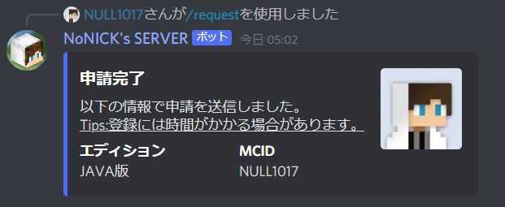
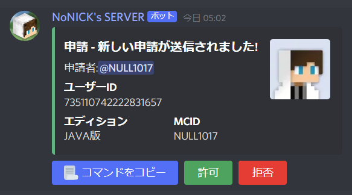

# DiscordBot-NoNickCraft

Minecraftのサーバー運営の支援を行うBOT

Discord.js v13に追加されたスラッシュコマンドやボタン等を積極的に使用しているため、視覚的にわかりやすく、ストレスフリーで使用することができます。

# Features

* `/request` ... ホワイトリストに追加するための申請を送信することができます。指定したチャンネル以外では使用できず、使用すると申請情報がモデレーターチャンネルに転送されます。
  
  

# Requirement
このBOTの動作には以下のライブラリが必要です。

* discord.js 13.6.0
* @discordjs/builders 0.12.0
* @discordjs/rest 0.3.0
* discord-api-types 0.30.0
* dotenv 16.0.0

# Installation
以下のコマンドをコンソールに入力することでライブラリをインストールできます。
```npm
npm install discord.js @discordjs/builders @discordjs/rest discord-api-types dotenv
```

# Usage
このBOTを起動する前に、新規作成した`config.json` に以下の情報を書き込む必要があります。

```json
{
    "clientId": "DiscordBOTのクライアントID",
    "guildId": "スラッシュコマンドを登録するサーバーID",
    "modCh": "モデレーターチャンネル",
    "requestCh": "/request の使用を許可するチャンネル",
    "playerrole": "/request を承認した人に与えるロール",
    "beplayerprefix": "GeyserMCでBEプレイヤーに設定している接頭辞"
}
```
同じく新規作成した`.env` にはDiscordBOTのtokenを入力します。

(注意:tokenは漏洩するとサーバー荒らし等に使用される場合があるため、取り扱いには十分注意してください。)
```
BOT_TOKEN=DiscordBOTのtoken
```

また、サーバーにスラッシュコマンドを登録するには、deploy-commands.jsを実行します。
(スラッシュコマンドの動作等を変更しない限り、一回の起動だけで大丈夫です。)
```npm
node .\deploy-commands.js
```

# Note

* このリポジトリのファイルはNoNICK's SERVER用に最適化されています。自分のサーバー用にカスタマイズするには適時書き換えてください。